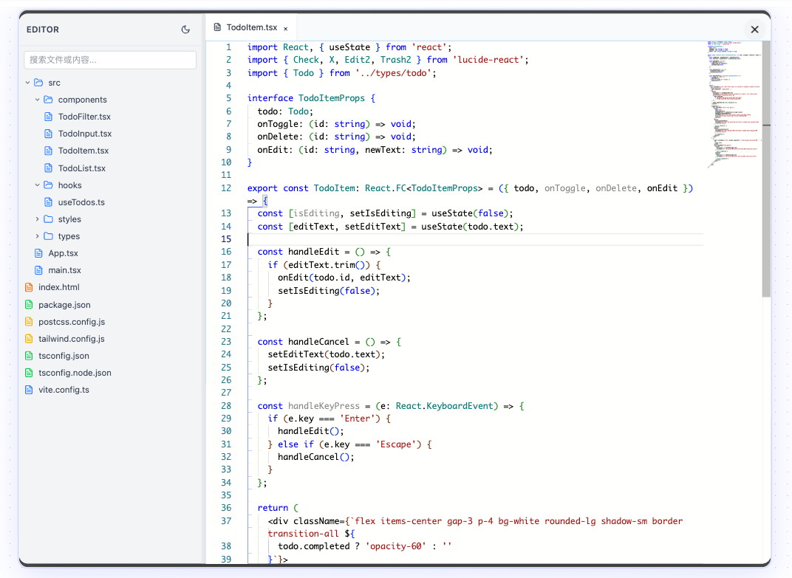

# 代码编辑器演示（Code Editor Demo）


这是一个基于 React + Monaco Editor 的多文件、多目录结构代码编辑器演示项目。支持文件夹嵌套、文件内容编辑、主题切换、文件搜索等功能，适合用作在线代码演示、教学或二次开发。

## 特性

- 🗂️ 支持多级文件夹与文件树结构自动识别与渲染
- 📝 集成 Monaco Editor，体验媲美 VSCode 的代码编辑
- 🌗 支持明暗主题切换
- 🔍 支持文件名与内容搜索
- 🏷️ 支持多标签页浏览与编辑
- 🔒 支持只读与可编辑模式切换
- ⚡ 基于 React + TypeScript + TailwindCSS 构建，易于扩展

## 快速开始

### 1. 克隆项目

```bash
git clone https://github.com/your-username/your-repo-name.git
cd your-repo-name
```

### 2. 安装依赖

```bash
pnpm install
# 或
npm install
# 或
yarn install
```

### 3. 启动开发环境

```bash
pnpm dev
# 或
npm run dev
# 或
yarn dev
```

访问 [http://localhost:5173](http://localhost:5173) 查看效果。

## 目录结构

```
├── src/
│   ├── App.tsx                # 入口组件，文件树构建逻辑
│   ├── components/
│   │   ├── CodeEditor.tsx     # 编辑器主界面
│   │   ├── FileExplorer.tsx   # 文件/文件夹树组件
│   │   └── StatusBar.tsx      # 状态栏（可选）
│   ├── index.css
│   └── main.tsx
├── index.html
├── package.json
├── tailwind.config.js
└── ...
```

## 如何自定义文件结构

只需在 `src/App.tsx` 的 `fileMap` 中添加或修改文件路径和内容，支持多级目录（如 `src/utils/helper.ts`），会自动渲染为树状结构。

## <CodeEditor /> 组件用法

`CodeEditor` 是本项目的核心组件，用于渲染多文件/多目录的代码编辑界面。

### Props

| 名称      | 类型         | 说明                       |
| --------- | ------------ | -------------------------- |
| files     | FileItem[]   | 文件树结构，支持嵌套文件夹 |
| readOnly  | boolean      | 是否只读（可选，默认true） |

#### FileItem 结构

```ts
interface FileItem {
  id: string;
  name: string;
  type: 'file' | 'folder';
  content?: string;      // 仅文件有
  language?: string;     // 仅文件有
  children?: FileItem[]; // 仅文件夹有
}
```

### 示例

```tsx
import CodeEditor from './components/CodeEditor';

const files = [
  {
    id: '1',
    name: 'src',
    type: 'folder',
    children: [
      {
        id: '2',
        name: 'index.tsx',
        type: 'file',
        content: "export const index = () => 'index';",
        language: 'typescript',
      },
    ],
  },
  {
    id: '3',
    name: 'readme.md',
    type: 'file',
    content: '# 示例',
    language: 'markdown',
  },
];

<CodeEditor files={files} readOnly={false} />
```

### 注意事项
- `files` 必须为树状结构，文件夹的 `children` 为其子文件/文件夹。
- `id` 必须唯一。
- `language` 推荐填写以获得更好的语法高亮。
- `readOnly` 为 `true` 时不可编辑。

## 公共方法：buildFileTree

`buildFileTree` 是一个用于将扁平的文件路径对象自动转换为树状结构的工具函数，便于配合 <CodeEditor /> 组件渲染多级目录。

### 用途
- 将如下格式的对象：

```js
const fileMap = {
  'hello.ts': '...代码...',
  'src/index.tsx': '...代码...',
  'docs/readme.md': '...内容...'
}
```

- 自动转换为 <CodeEditor /> 组件所需的树状结构：

```js
import { buildFileTree } from './utils/fileTree';

const files = buildFileTree(fileMap);
<CodeEditor files={files} />
```

### 参数说明
- `fileMap: Record<string, string>`  
  键为文件路径（支持多级目录），值为文件内容。
- 返回值：`FileItem[]`  
  树状结构的文件/文件夹数组，可直接传递给 <CodeEditor />。

### 特点
- 自动识别多级目录，生成嵌套 children
- 文件夹始终排在文件前面，且同类型按名称排序
- 适合任何需要文件树结构的场景

---

## 贡献

欢迎提 Issue 或 PR 参与贡献！

1. Fork 本仓库
2. 新建分支进行开发
3. 提交 PR 并描述你的更改

## License

MIT 